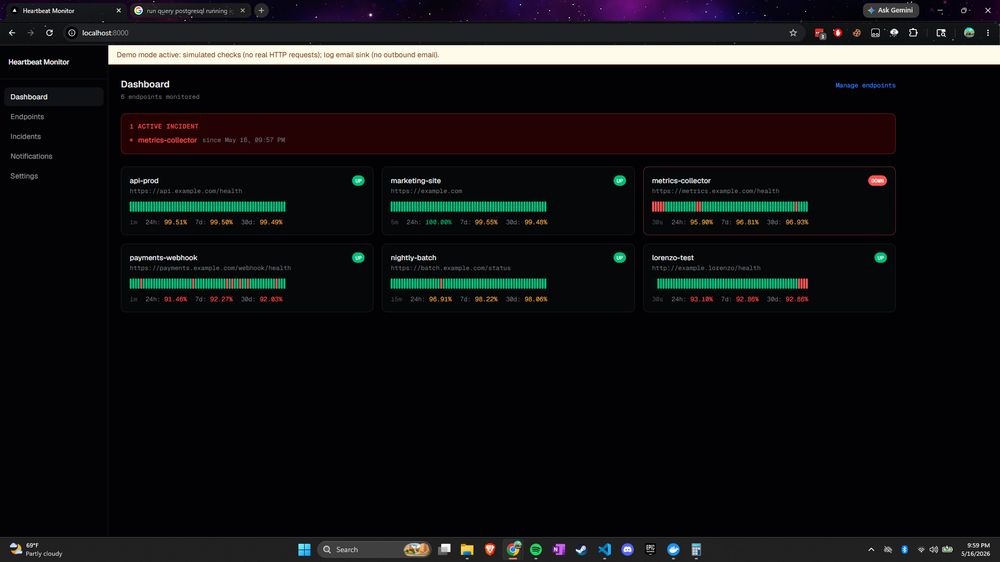
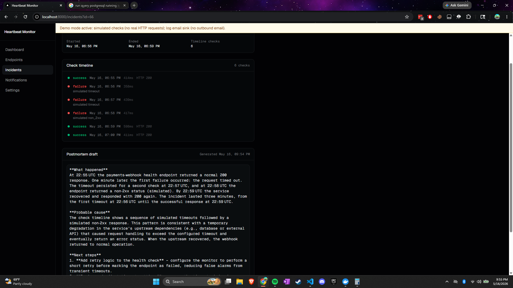
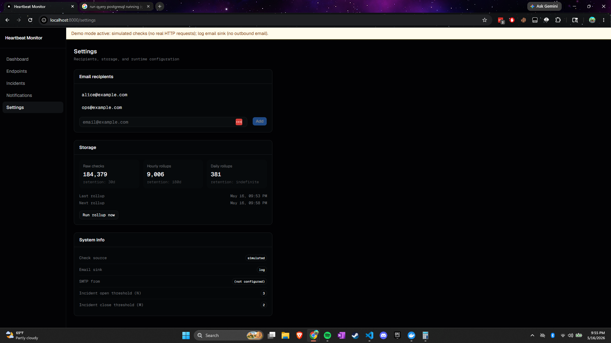

# Heartbeat Monitor

Heartbeat Monitor is a self-hosted uptime monitor and status page. It polls user-registered HTTP(S) endpoints on a schedule, records every check result, raises incidents when an endpoint fails repeatedly, and generates AI-powered plain-English postmortem drafts on demand. A simulated mode replaces real HTTP checks with synthetic results so the full product can be explored without any live endpoints or outbound email.

## Screenshots

_Dashboard showing endpoint state badges, recent-check strips, and uptime percentages:_



_Incident detail with AI-generated postmortem draft:_



_Settings page — storage panel and recipients editor:_



## Run the demo

Requires Docker and Docker Compose.

```sh
./scripts/start.sh --demo   # start in simulated mode with log email sink
# visit http://localhost:8000
./scripts/stop.sh --wipe    # stop and wipe the database volume (re-seed on next start)
```

On Windows (PowerShell):

```powershell
.\scripts\start.ps1 -Demo
# visit http://localhost:8000
.\scripts\stop.ps1 -Wipe
```

The `--demo` flag sets `CHECK_SOURCE=simulated` and `EMAIL_SINK=log`. On first startup against an empty database, the backend pre-seeds approximately 75 days of synthetic history across five example endpoints, including several past incidents and rollup data in all three storage tiers. A banner in the UI indicates that simulated and log modes are active.

To start in real mode (live HTTP checks, SMTP alerts), copy `.env.example` to `.env`, fill in `DATABASE_URL` and your SMTP credentials, then:

```sh
./scripts/start.sh
```

## Modes

Two independent runtime switches govern check and alert behavior:

| Switch | Env var | Values | Default |
|---|---|---|---|
| Check source | `CHECK_SOURCE` | `real` / `simulated` | `real` |
| Email sink | `EMAIL_SINK` | `smtp` / `log` | `smtp` |

**`CHECK_SOURCE=real`** — the scheduler makes actual HTTP GET requests to each endpoint's URL. Use this for production uptime monitoring.

**`CHECK_SOURCE=simulated`** — no outbound HTTP. The scheduler generates synthetic results from each endpoint's simulator config (failure rate, latency range, optional outage windows). Use this for demos and local development.

**`EMAIL_SINK=smtp`** — alert emails are sent through your configured SMTP server when incidents open or close.

**`EMAIL_SINK=log`** — alert emails are captured to the database and shown in the in-app Sent Notifications panel; nothing is sent outbound. Useful with a local or test deployment.

The two switches are independent: you can run real checks with a log sink during development, or simulated checks with SMTP for a staging environment.

A visible banner appears in the UI whenever either switch is in its non-default state.

## Configuration

All configuration is via environment variables. Copy `.env.example` to `.env` for local development.

| Variable | Default | Required | Description |
|---|---|---|---|
| `DATABASE_URL` | — | Yes | Postgres connection string, e.g. `postgresql+asyncpg://user:pass@db:5432/heartbeat` |
| `CHECK_SOURCE` | `real` | No | `real` or `simulated` |
| `EMAIL_SINK` | `smtp` | No | `smtp` or `log` |
| `SMTP_HOST` | — | If `EMAIL_SINK=smtp` | SMTP server hostname |
| `SMTP_PORT` | `587` | No | SMTP server port |
| `SMTP_USERNAME` | — | If `EMAIL_SINK=smtp` | SMTP username |
| `SMTP_PASSWORD` | — | If `EMAIL_SINK=smtp` | SMTP password |
| `SMTP_FROM` | — | If `EMAIL_SINK=smtp` | From address for alert emails |
| `SMTP_STARTTLS` | `true` | No | Whether to use STARTTLS |
| `OPENROUTER_API_KEY` | — | For AI postmortems | API key for OpenRouter (used by the postmortem generator) |
| `OPENROUTER_MODEL` | `openai/gpt-oss-120b` | No | LLM model to use via OpenRouter |
| `SCHEDULER_CONCURRENCY` | `50` | No | Max concurrent in-flight checks |
| `LOG_LEVEL` | `INFO` | No | Backend log level |

For a public demo deployment, set a spend cap on your OpenRouter key to bound exposure from repeated postmortem generation.

## How would we scale this?

The MVP is a single FastAPI process on one machine. Here is the scale-out path, one step at a time:

**Separate scheduler service.** Extract the scheduler loop into its own process (or container) so it can be scaled and deployed independently of the API.

**Queue or broker for check dispatch.** Replace the in-memory `in_flight` set with claim-based dispatch via `SELECT ... FOR UPDATE SKIP LOCKED` on the endpoints table (zero new infrastructure) or Redis Streams (higher throughput, cross-process visibility); the scheduler enqueues due endpoints and workers dequeue and execute them.

**Stateless check workers.** Run N worker replicas that each pull from the queue and perform HTTP checks, emit results back to a results queue, and write nothing to the database themselves — keeping the check hot path I/O-free and horizontally scalable.

**Separate alert worker.** Move alert dispatch (SMTP sends, notification writes) into its own consumer process so a slow mail server does not back-pressure the check result pipeline.

**Partition raw check_results by day.** PostgreSQL declarative partitioning on `checked_at::date` makes retention deletes instant (`DROP PARTITION`) and keeps per-day scans small; TimescaleDB hypertables automate partition management and add time-series query optimizations for free.

**Cold object-storage archive.** Export daily rollups and aged-out raw partitions to S3 or GCS as Parquet files so long-range history queries can run against object storage (via DuckDB or Athena) without keeping years of data in Postgres.

**Push-based UI updates.** Replace TanStack Query polling with Server-Sent Events or WebSockets so the dashboard reflects new check results and incident state changes in real time without per-client polling overhead.

## Design and implementation docs

- [`docs/REQUIREMENTS.md`](docs/REQUIREMENTS.md) — product scope, behaviors, and non-goals.
- [`docs/DESIGN.md`](docs/DESIGN.md) — technical decisions: data model, key interfaces, scheduler, storage tiers, AI integration.
- [`docs/PLAN.md`](docs/PLAN.md) — phased implementation order with per-phase acceptance criteria.
